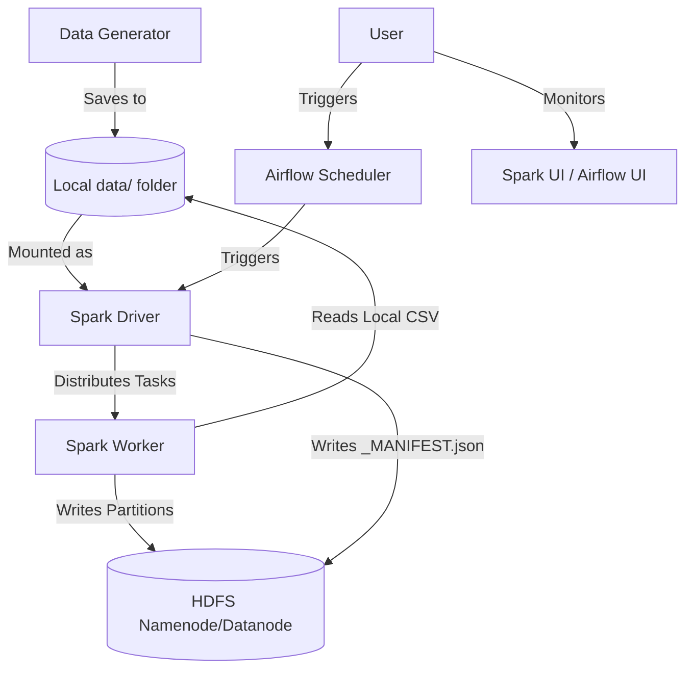

# Hadoop-Based Batch Analytics Pipeline for CDR

A production-style batch analytics pipeline for processing telecommunications Call Detail Records (CDRs) using **Apache Spark**, **Hadoop HDFS**, and **Apache Airflow**.

## 📊 Overview
This project implements a high-performance distributed processing system designed to handle massive datasets with significant data skew. It features custom partitioning and salting strategies to optimize computations for 2,000,000+ records.

---

## 🏗️ System Architecture



### Technology Stack
- **Storage**: HDFS (Hadoop 3.2.1)
- **Processing Engine**: Apache Spark 3.5.0
- **Orchestration**: Apache Airflow 2.8.0
- **Environment**: Dockerized (Multi-container architecture)

---

## 🚀 Key Performance Features

### 1. Data Skew Mitigation (Salting)
Telecom data often contains "Whale Callers" (users with 100x more records than average). 
- **Problem**: A single Spark task processing a Whale Caller becomes a bottleneck (the "straggler" effect).
- **Solution**: Implemented a **Salting Strategy** in `top_callers.py`. We add a random salt to the skewed key, distribute the partial aggregation across multiple tasks, and perform a final global aggregation.

### 2. Custom RDD Partitioner
For queries requiring user-level statistics (e.g., mean/stddev in `anomalous_calls.py`), data locality is critical.
- **Solution**: Built a custom hash-based partitioner to ensure all records for a given `caller_id` are processed by the same reducer, minimizing network shuffles and enabling efficient local stateful aggregations.

### 3. Native Spark CSV Ingestion
Replaced manual string parsing with Spark's native DataFrame CSV reader, utilizing schema inference and optimized ingestion for a 5x speedup in data loading.

---

## 📂 Project Structure
- `data/`: Raw CDR data and generation scripts.
- `jobs/`: PySpark implementation for the 4 analytical queries.
- `dags/`: Airflow DAG definitions for orchestration.
- `output/`: Local mount for viewing job results (HDFS-integrated).

---

## 🛠️ Setup & Execution

### Prerequisites
- Docker & Docker Desktop.
- At least 8GB RAM allocated to Docker.

### 1. Start the Cluster
```bash
docker-compose up -d --build
```
*Wait for all containers (Airflow, Namenode, Spark) to become healthy.*

### 2. Run an Analytical Query
Use the provided utility script to trigger specific DAGs:
```bash
# Available: top_callers, tower_heatmap, anomalous_calls, revenue_recon
./run_pipeline.sh top_callers
```

### 3. Verify Results in HDFS
Jobs produce output in HDFS along with a `_MANIFEST.json` containing record counts and latency metrics.
```bash
# List all outputs
docker exec namenode hdfs dfs -ls -R /output

# View a specific manifest
docker exec namenode hdfs dfs -cat /output/top_callers_by_spend/<run_id>/_MANIFEST.json
```

---

## 📈 Monitoring Dashboards
- **Airflow**: [http://localhost:8082](http://localhost:8082) (Login: `admin`/`admin`)
- **Spark Master**: [http://localhost:8081](http://localhost:8081)
- **Hadoop Namenode**: [http://localhost:9870](http://localhost:9870)

---

## 📝 Design Decisions
- **HDFS Integration**: Switched from local bind-mounts to HDFS to resolve distributed permission issues across Docker containers.
- **SequentialExecutor**: Used in Airflow for a simplified single-node deployment suitable for batch processing demonstrations.
- **Observability**: Implemented a manifest system using Py4J to allow Spark drivers to write metadata directly to HDFS.
